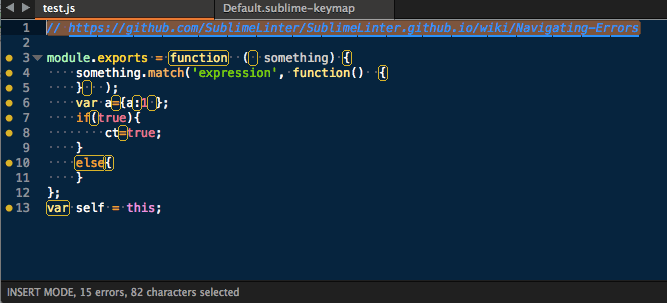
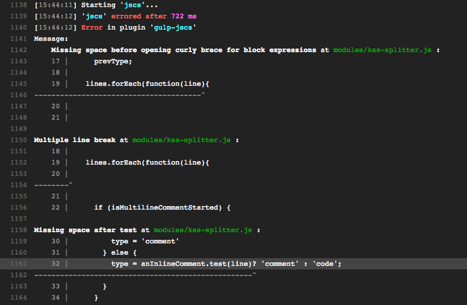

---

layout: default

style: |

  .slide.large {
    font-size: 36px;
  }
  .slide>div {
    padding-top: 48px;
  }
  .slide h2 {
    font-size: 48px;
  }
  .slide h3 {
    font-size: 36px;
  }

  .slide pre code {
    line-height: 1.5em;
  }

  .slide mark.next {
    background-color: transparent;
  }

  #Cover {
    background-color: #F1DA4E;
    background-image: url(pictures/jscs.png);
    background-size: contain;
    background-position: 50% 50%;
    background-repeat: no-repeat;
  }
  #Cover div {
    text-align:center;
  }
  #Cover h2 {
    display: none;
  }
  #Cover h3 {
    position: absolute;
    bottom: 0;
    width: 800px;
    text-align: center;
    font-size: 48px;
  }

  #Picture h2 {
    color:#FFF;
  }

  .picture h2 {
    display: none;
  }

  .me .avatar {
    width: 400px;
    height: 400px;
    background-image: url(pictures/varya.jpg);
    background-size: 400px auto;
    background-position: 50% 0;
    background-repeat: no-repeat;
    border-radius: 50%;
    float: left;
    margin-right: 48px;
  }

  .me h3 {
    font-size: 36px;
  }

  .godfather {
    background-color: #000;
    color: #FFF;
  }
  .godfather div {
    text-align: center;
    background-image: url(pictures/godfather.png);
    background-size: 75%;
    background-position: 50% 50%;
    background-repeat: no-repeat;
    text-transform: uppercase;
    -webkit-text-stroke-width: 2px;
    -webkit-text-stroke-color: black;
    font-family: Impact;
    font-size: 40px;
  }
  .godfather::after {
    content: '';
  }
  .godfather h2 {
    display: none;
  }
  .godfather .top {
    position: absolute;
    top: 25px;
    width: 800px;
  }
  .godfather .bottom {
    position: absolute;
    bottom: 0;
    width: 800px;
    font-size: 45px;
  }

  .with-link div {
    font-size: 120px;
  }
  .with-link h2 {
    display: none;
  }

---

# JavaScript CodeStyle. Automatically!
{: .cover #Cover }

### in use at SC5

## me
{: .me }

###Varya Stepanova

Senior Frontend Developer @ SC5 Online

## Codestyle is important
{: .godfather }

You develop but you don't code with respect
{: .top}

You don't even follow the codestyle
{: .bottom }

## JavaScript linting tools
{: .large }

<ul>
<li>JSLint</li>
<li>JSHint</li>
<li>JSCS</li>
</ul>

## JSHint ❤ JSCS
{: .jshint }

<blockquote class="twitter-tweet" lang="ru">
And with that, JSCS now has all the style enforcement rules that are
being dropped in <a href="https://twitter.com/JSHint">@JSHint</a> 3.0: <a
href="https://t.co/W98EMSiTN5">https://t.co/W98EMSiTN5</a> cc <a
href="https://twitter.com/valueof">@valueof</a>
&mdash; Mike Sherov (@mikesherov) <a
href="https://twitter.com/mikesherov/status/419596672520318976">4 января 2014</a></blockquote>

## <s>JSLint</s>
{: .large }

    gulp.task('jslint',
      [ 'jshint', 'jscs' ]
    );

<footer>Presenter note for the first slide</footer>

## JSCS in use
{: .logos }

## JSCS

    $ npm install jscs

* project-dependent with `.jscsrc`
* Presets
* Tunable
* Friednly to grunt, gulp
* Supported by editors

## .jscsrc presets

    {
        "preset": "airbnb",
        <mark class="comment">/*
        "preset": crockford,
        "preset": google,
        "preset": jquery,
        "preset": mdcs,
        "preset": wikimedia,
        "preset": yandex
        */</mark>
    }

## to exclude

    {
        "preset": "airbnb",

        <mark class="important">"excludeFiles"</mark>: [
          "node_modules/**"
        ]
    }

## to extend

    {
        "preset": "airbnb",

        <mark class="important">"validateIndentation": 2,</mark>
        <mark class="important">"requireMultipleVarDecl": true,</mark>

        "excludeFiles": [
          "node_modules/**"
        ]

    }

## In use
{:.shout}

## One by one
{: .one-by-one }

    {
        ...

        "excludeFiles": [
          "node_modules/**",
          "src/modules/a/**",
          "src/modules/b/**",
          "src/*.js
        ]
    }

* Change file
* Change codestyle
* Remove from excluded

## Pushy
{: .picture }

## Division of responsibility
{: .division }

<table><tr>
<td markdown="1">

### upstream repository

<b class="must">must be clean</b>

* Pull requests
* Travis

</td><td markdown="1">

### your fork
<b class="may">may be clean</b>

* Editor
* Pre-comit hooks

</td>
</tr></table>

## Editor plugins

## Travis builds

## Some tips
{:.shout}

## In of memory

    gulp.task('jscs', function() {
      return gulp.src([
        '**/*.js'
      ])
      <mark class="next"><mark class="important">.pipe(gulpIgnore.exclude([</mark>
        <mark class="important">'node_modules/**',</mark>
        <mark class="important">'demo-output/**'</mark>
      <mark class="important">]))</mark></mark>
      .pipe(jscs());
    });

## Never stop watching

    gulp.task('jscs', function() {
      return gulp.src([
        '**/*.js'
      ])
      ...
      <mark class="next"><mark class="important">.pipe(plumber())</mark></mark>
      .pipe(jscs());
    });

## JSCS
{: .cover }

## Why?
{: .with-link}

[bit.ly/why-jscs](http://bit.ly/why-jscs)

## JSCS in use
{: .bye-bye }

Varya Stepanova, SC5 Online

[varya.me/jscs-talk](http://varya.me/jscs-talk/)
{: .large }

- [varya.me](http://varya.me)
- [@varya_en](http://twitter.com/varya_en)
- [mail@varya.me](mailto:mail@varya.me)

